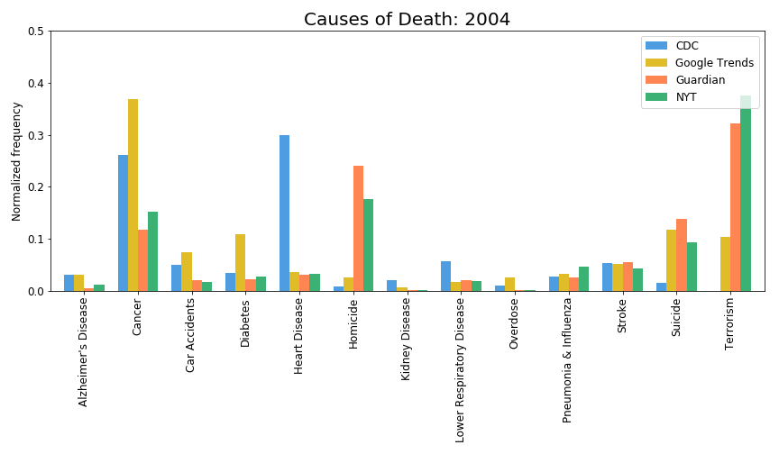

An analysis of empirical death distributions vs media representation:

By [Hasan Al-Jamaly](https://github.com/haljamaly), [Maximillian Siemers](https://github.com/phi1eas), [Owen Shen](https://github.com/owenshen24), and [Nicole Stone](https://github.com/stonecoldnicole).

The final project for the COGS108 course at UCSD, taught by Professor [Bradley Voytek](http://darb.ketyov.com/).

The finalproject.ipynb walks you through our project, so just open that up, and everything should be well-documented if you want to follow along with our analysis! :-)
